```markdown
# PayLoom — Payroll Management System (MERN + Ant Design)

A full-stack payroll app with **Admin** and **Employee** roles.

- **Admin**: Create/update **salary slips**, review/approve/reject **expenses**, manage **employees**, email notifications.
- **Employee**: View/filter **salary slips**, **download PDF** (INR format), submit **expenses** (modal).

---

## 🌐 Live Demo

- **Frontend (Vercel):** _<your-frontend-url-here>_
- **Backend (Render):** _<your-backend-url-here>_

**Demo Login (required by assignment)**  
`Email: hire-me@anshumat.org`  
`Password: HireMe@2025!`

---

## ✅ Features

- Auth (Login/Signup) with **role-based** access (Admin / Employee)
- **Admin**
  - Create/Update **Salary Slips** (net pay auto-computed)
  - **Review Expenses**: approve/reject (workflow & toasts)
  - **Employees**: list + **Add Employee** (modal)
  - **Emails**: slip created, expense status updated (Nodemailer + branded HTML)
- **Employee**
  - **My Slips**: list, month filter, **PDF download** (styled, INR currency)
  - **My Expenses**: list + **Submit Expense** modal
- **UI/UX**
  - Atlas-like **dark theme**, **green table headers**, custom scrollbars
  - Responsive tables, sticky header safety fixes
- **PDF**
  - pdfkit with PayLoom brand: green header, meta card, banded rows, INR formatting

---

## 🧭 Screenshots

### Admin

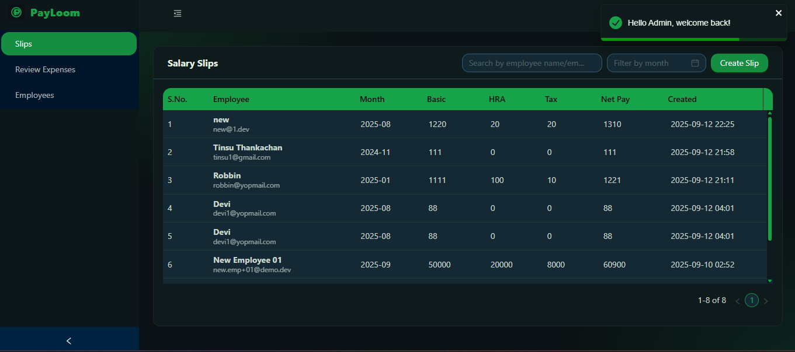
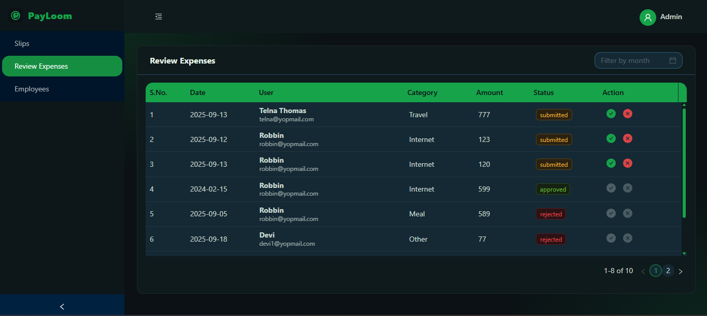
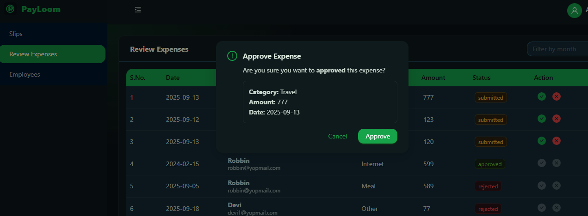
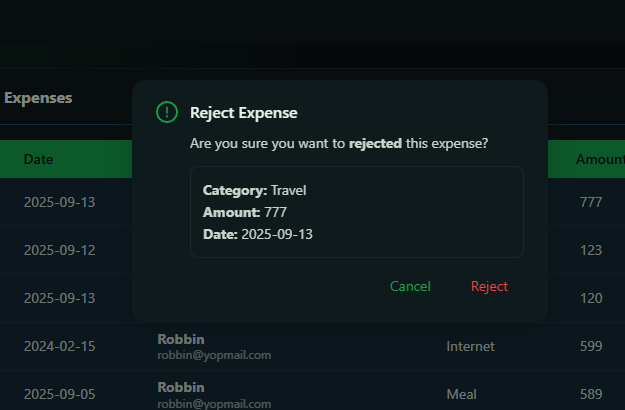
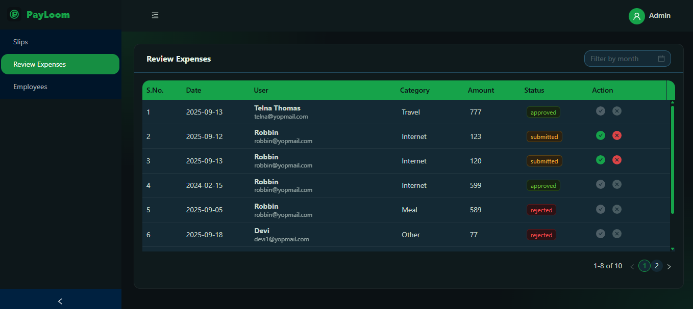
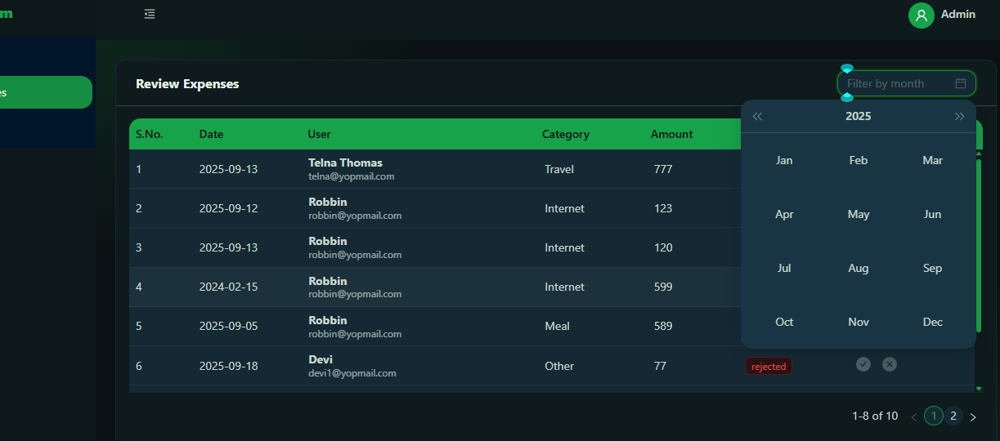
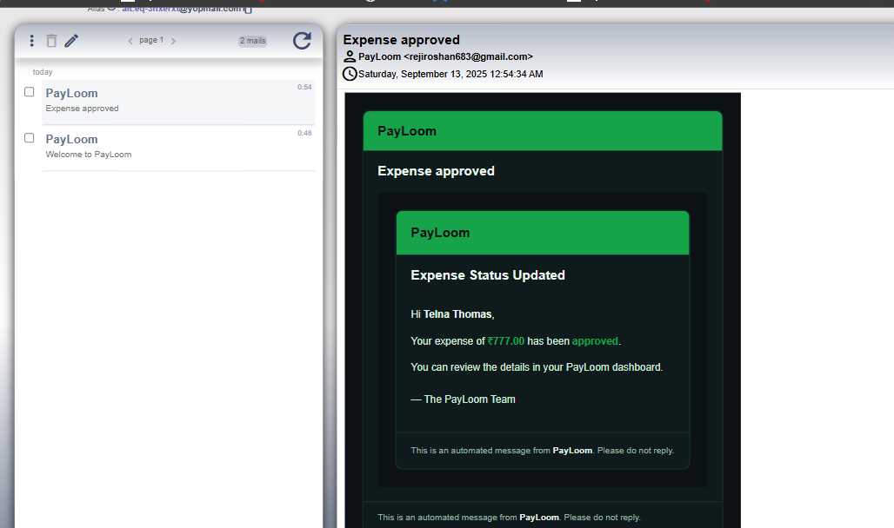
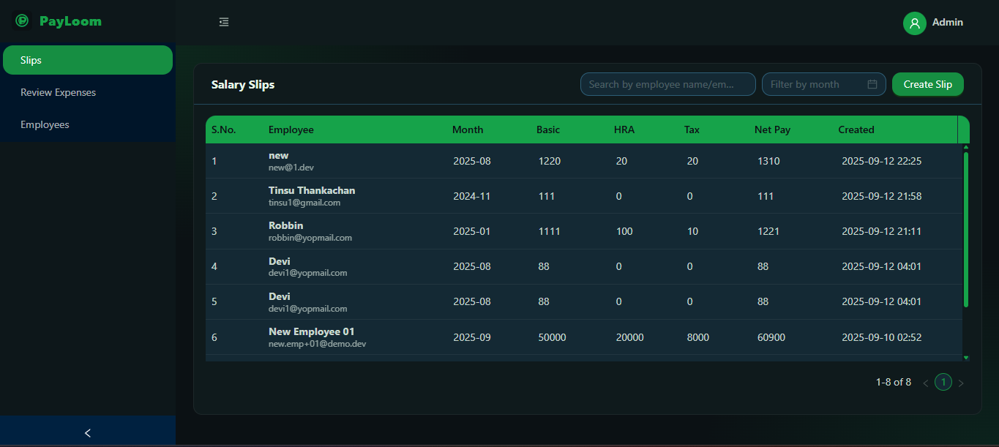
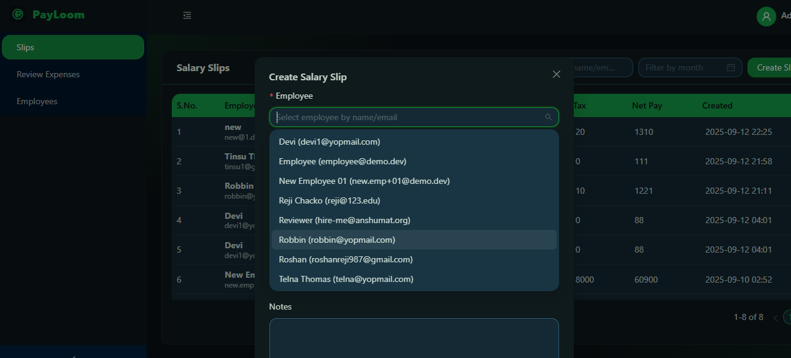
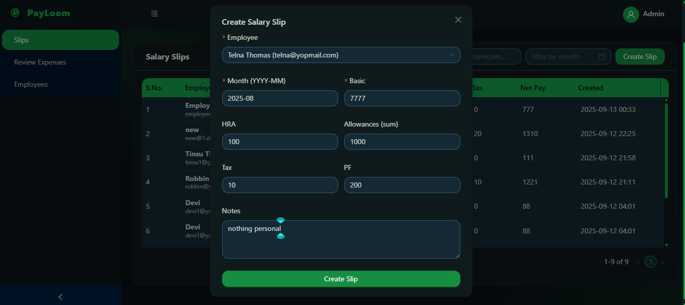
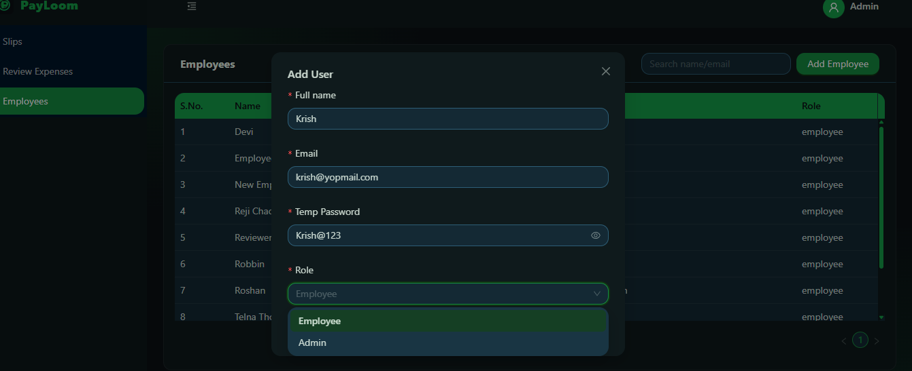
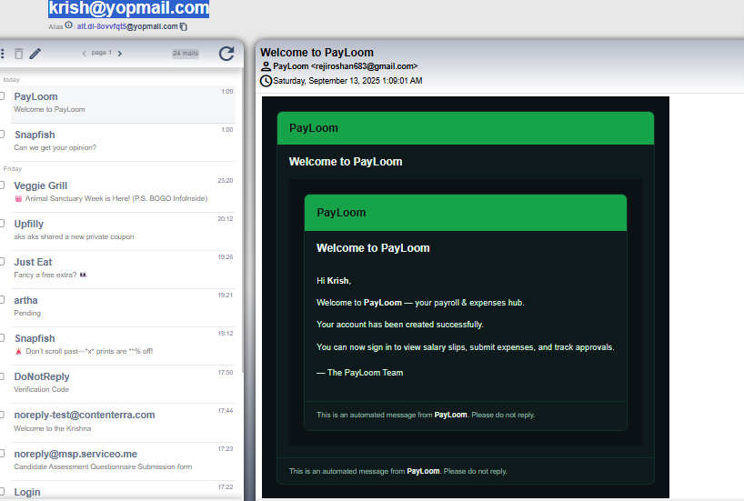
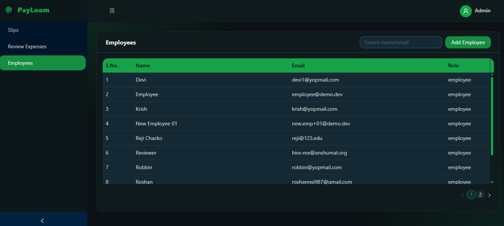

### Employee

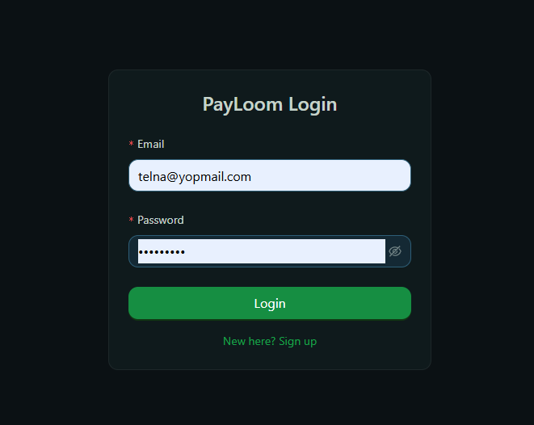
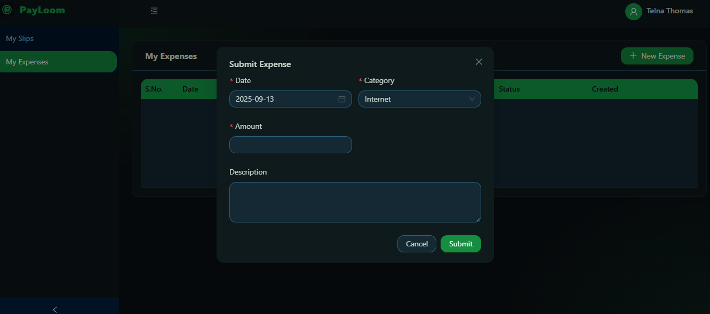
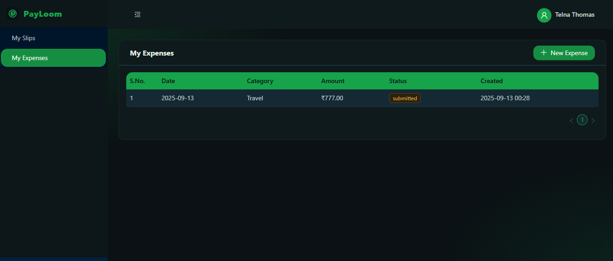
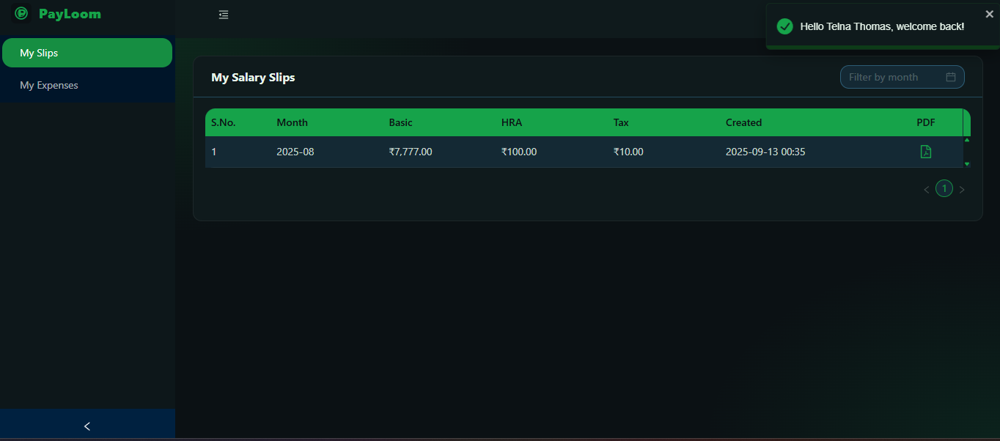
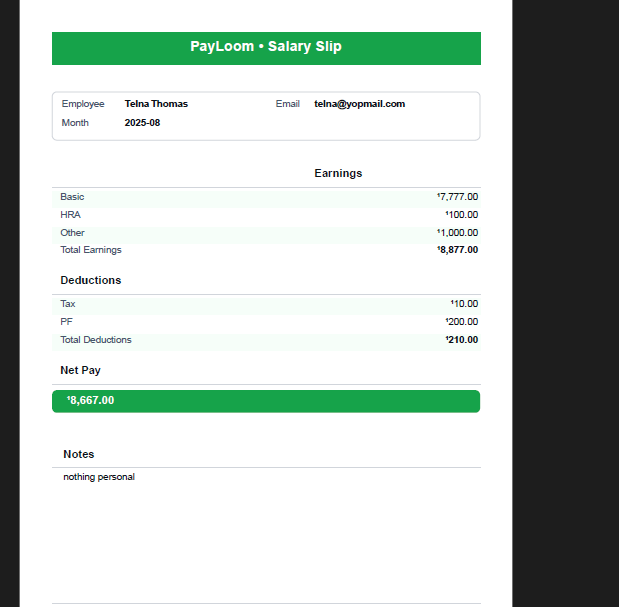
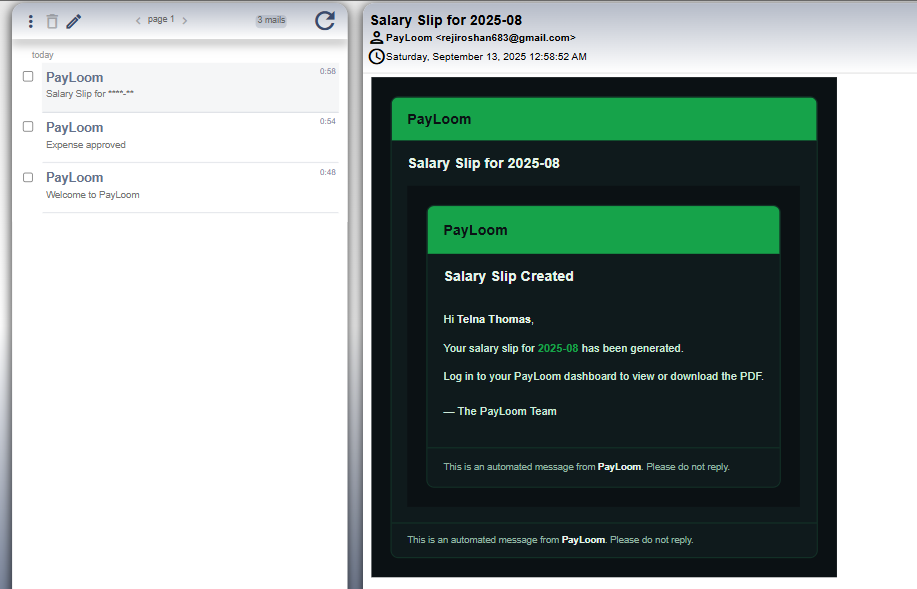
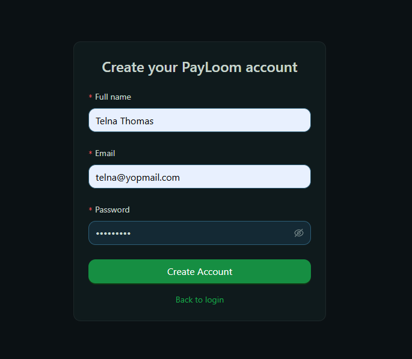
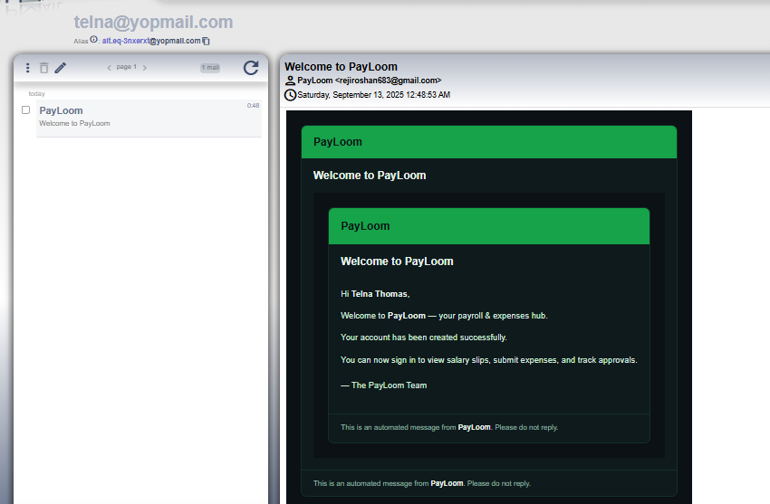

---

## 🧩 Tech Stack & Rationale

- **Frontend:** React + Ant Design — fast for data-heavy dashboards with solid, accessible components.
- **Backend:** Node.js (Express) + MongoDB (Mongoose) — simple schemas, quick CRUD, role-based guards, fast iteration.
- **Auth:** JWT + role/middleware guards.
- **Mail:** Nodemailer (SMTP) + HTML templates (PayLoom branding).
- **PDF:** pdfkit with INR currency formatting.
- **Deploy:** Frontend on **Vercel**, Backend on **Render**.

---

## 📁 Project Structure

```

.
├── frontend/                      # React + Ant Design (Vite)
│   └── src/
│       ├── pages/admin/           # Slips, ExpensesReview, Employees
│       ├── pages/employee/        # MySlips, MyExpenses (+ SubmitExpense modal)
│       ├── components/            # EmployeeSelect, modals
│       ├── context/               # AuthContext
│       ├── routes/                # ProtectedRoute
│       ├── lib/                   # axios api client
│       ├── ui/                    # toast host
│       ├── theme.ts, index.css    # dark theme + atlas table header
│       └── types.ts
├── backend/                       # Express + Mongoose
│   └── src/
│       ├── modules/
│       │   ├── auth/              # controller, service, routes
│       │   ├── users/             # model, repo
│       │   ├── expenses/          # model, repo, service (workflow + emails)
│       │   └── salary-slips/      # model, repo, service (netPay calc)
│       ├── mailer/                # nodemailer, baseLayout, templates
│       ├── pdf/                   # slipPdf.ts (styled PDF, INR)
│       ├── middleware/            # authGuard, roleGuard, validate
│       ├── core/                  # error, security (hash/jwt)
│       └── config/                # env
└── docs/
└── screenshots/               # images used in README (admin/, employee/)

```

---

## ⚙️ Environment

Create `.env` files before running.

**backend/.env**
```

PORT=4000
MONGODB\_URI=<your-mongodb-atlas-uri>
JWT\_SECRET=<strong-secret>
JWT\_COOKIE\_NAME=payloom\_jwt
COOKIE\_DOMAIN=localhost
FRONTEND\_ORIGIN=[http://localhost:5173](http://localhost:5173)

SMTP\_HOST=<smtp-host>
SMTP\_PORT=587
SMTP\_USER=<smtp-user>
SMTP\_PASS=<smtp-pass>
MAIL\_FROM="PayLoom [no-reply@payloom.app](mailto:no-reply@payloom.app)"

```

**frontend/.env**
```

VITE\_API\_BASE\_URL=[http://localhost:4000](http://localhost:4000)

````

---

## 🧪 Run Locally

```bash
# backend
cd backend
npm i
npm run dev

# frontend (in a new terminal)
cd frontend
npm i
npm run dev
````

Open: **[http://localhost:5173](http://localhost:5173)**

---

## 🔐 API (Quick Reference)

**Auth**

* `POST /auth/signup`
* `POST /auth/login`
* `GET /auth/me`

**Admin**

* `POST /salary-slip`
* `PUT /salary-slip/:id`
* `GET /expense/admin/all`
* `PUT /expense/admin/:id/status`

**Employee**

* `GET /salary-slip?month=YYYY-MM`
* `POST /expense`
* `GET /expense`

---

## 🚀 Deployment

### Backend (Render)

1. New **Web Service** → root = `backend/`
2. Environment variables = from `backend/.env`
3. Build Command: `npm i`
4. Start Command: `npm run start` (or your prod script)
5. CORS: allow your Vercel domain

### Frontend (Vercel)

1. Import repo → Project root = `frontend/`
2. Env var `VITE_API_BASE_URL` → your Render backend URL
3. Deploy
4. Update **Live Demo** links in this README

---

## 🔔 Email Templates

* Shared `baseLayout` provides PayLoom styling.
* **Templates**: expense status update & slip created.
* Location: `backend/src/mailer/templates`.

---

## 🗺️ Roadmap

* Charts for salary & expense trends
* CSV export for expenses
* In-app notifications
* Audit entries for actions

---

## 📜 License

MIT

```
```
